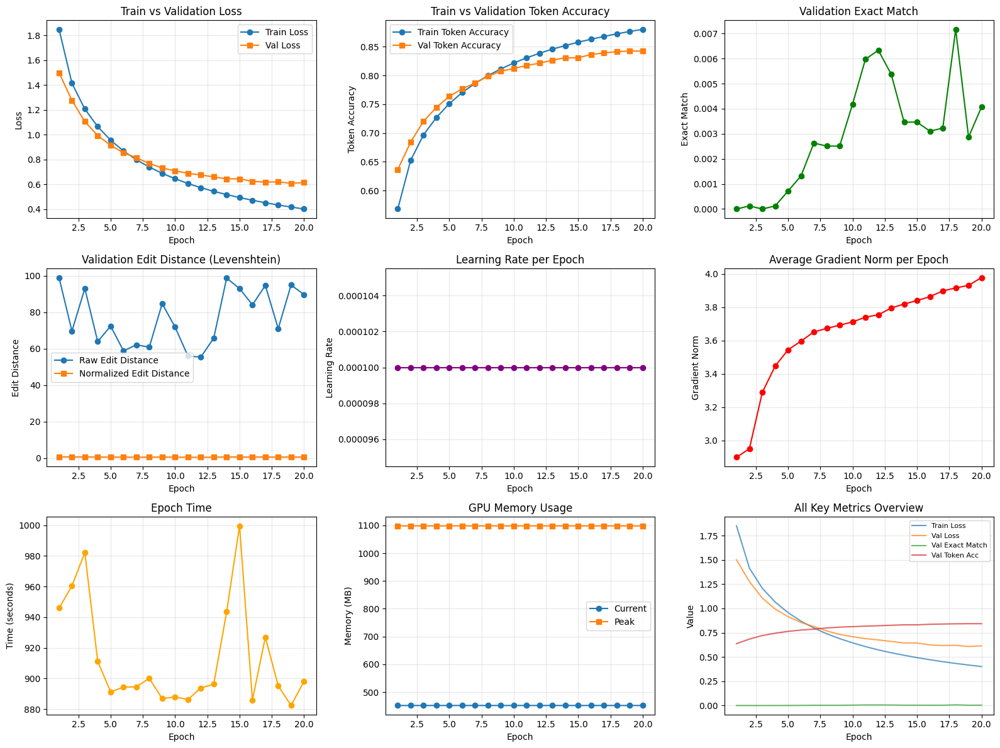
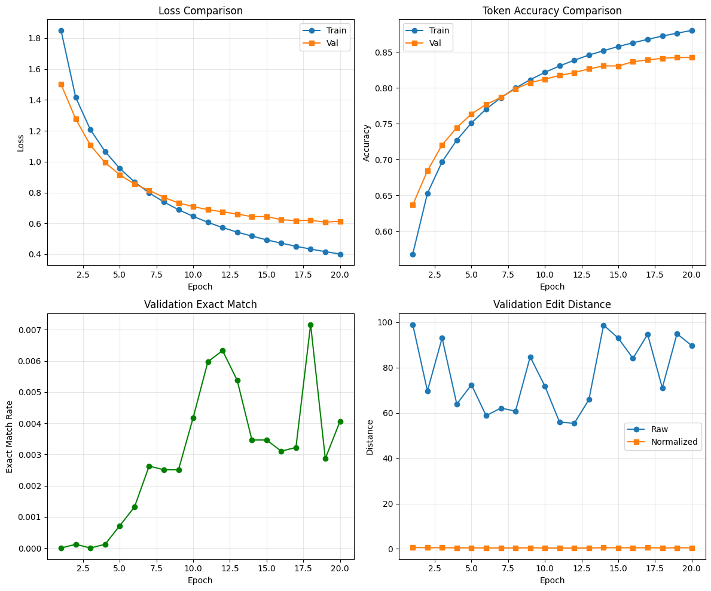
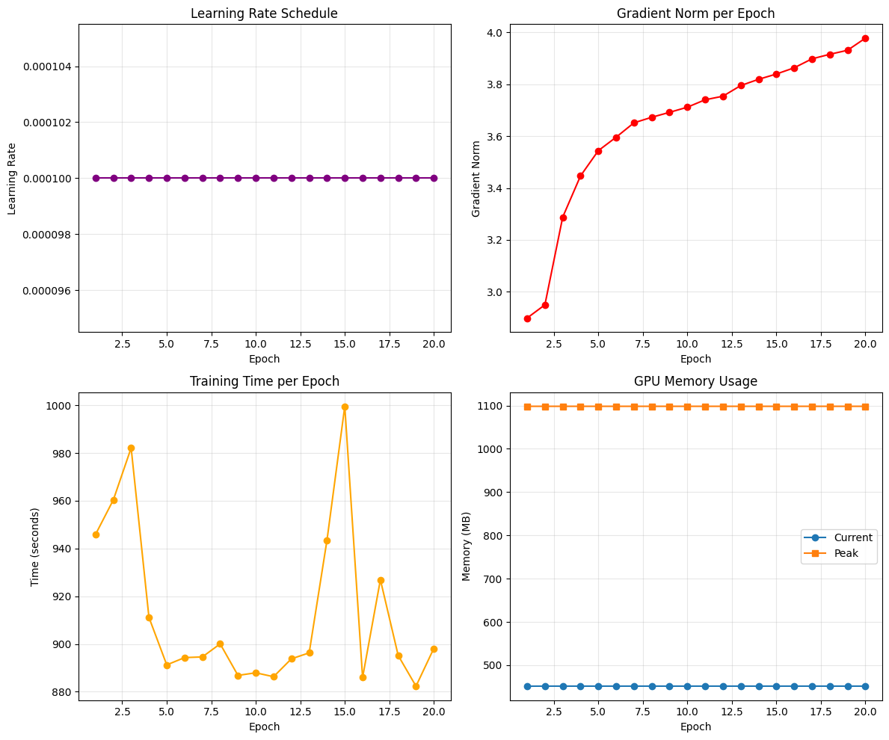

# im2latex

PyTorch project for converting equation images into LaTeX.

It uses a CNN encoder + Transformer decoder, with scripts for training, evaluation, inference, plotting, and a small FastAPI inference endpoint.

## Quick Start

```bash
pip install -r requirements.txt
python train.py
python infer.py --checkpoint checkpoints/im2latex_best.pt --split test
```

API server:

```bash
uvicorn app:app --host 0.0.0.0 --port 8000
```

## Main Files

- `train.py` / `train_small.py`: training loops
- `infer.py`: image to LaTeX prediction
- `eval.py`: validation metrics
- `plot_metrics.py`: training plot generation
- `data/`: dataset, tokenizer, transforms
- `models/`: encoder, decoder, full model

## Training Snapshot

From `logs/metrics.csv` (20 epochs):

- Best validation loss: 0.624 (epoch 17)
- Best validation token accuracy: 84.27% (epoch 19)
- Best exact match: 0.72% (epoch 18)

Exact match is still low, so this model is more useful as a baseline than a final production system.
Additional training is necessary.

## Plots

### Full Metrics Overview



### Evaluation Curves



### System/Training Details



## Dataset

Uses the im2latex-100k dataset from Kaggle:
https://www.kaggle.com/datasets/shahrukhkhan/im2latex100k

## Docker

```bash
docker build -f Dockerfile.train -t im2latex-train .
docker build -f Dockerfile.infer -t im2latex-infer .
```